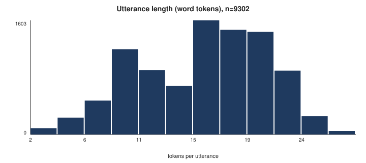
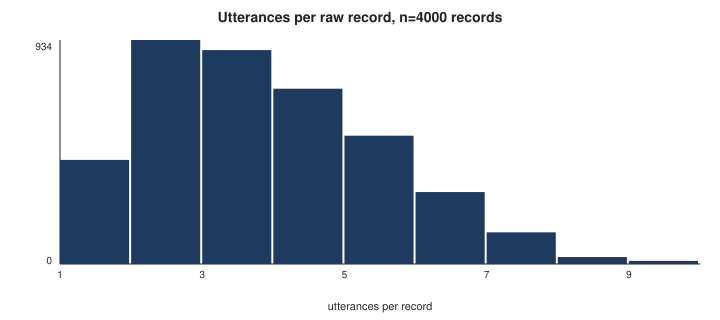
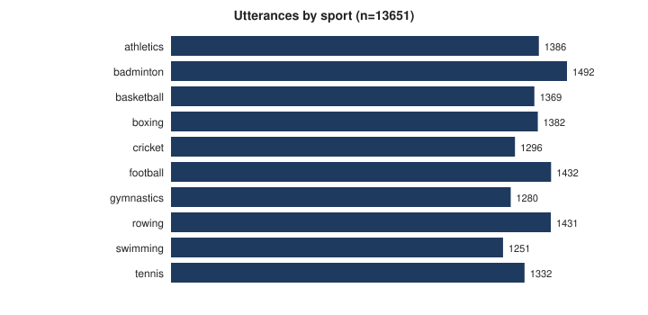
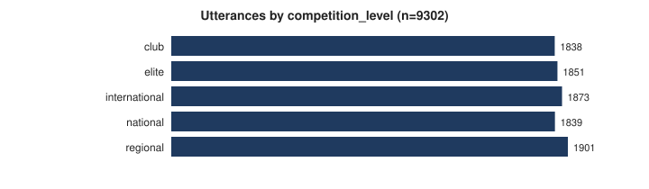
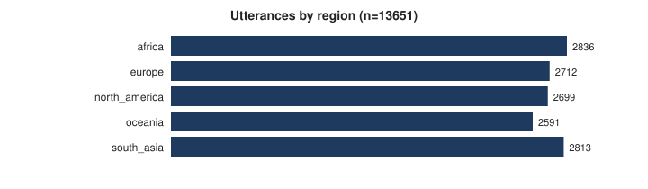
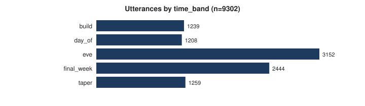
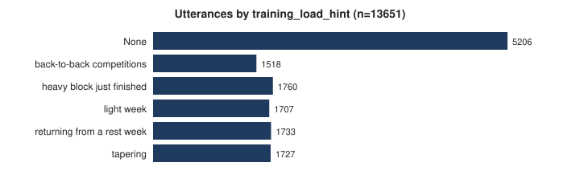
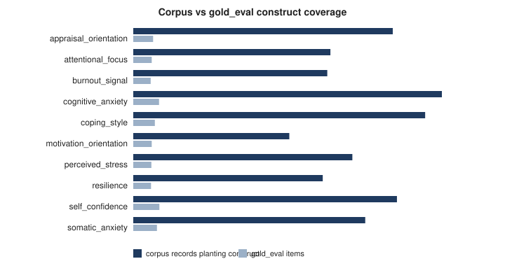

# Phase 9 — Exploratory Data Analysis & Quality Profiling

Source: `synth_precomp_v1` · generator `construct-template-grammar@1.3`, seed 42, n=4,000 records

> **This corpus is 100% synthetic (OPEN-011).** Every distribution below is a
> distribution over a template grammar written by this project. None of it is
> evidence about how athletes actually talk, and no sentence in this report
> should be quoted as if it were. The corpus exists so the pipeline can be
> built and measured before real text arrives; acquiring real pre-competition
> athlete text remains the project's highest live risk.

> **Unit warning.** Phase 8 turned 4,000 raw *records* into 13,651 *utterances*. Every number below is tagged with its
> unit. Per-record and per-utterance figures are not comparable, and Phase 7's
> per-record statistics are not comparable with anything here.

Everything in this file is regenerated by `python scripts/run_eda.py`. The
arithmetic lives in `src/evaluation/profile.py` and `src/evaluation/sampling.py`,
under `pytest`, not in a notebook.

## 0. What changed, and every number it superseded

Phase 9 closed three corpus defects in sequence. Each regeneration moves the
RNG stream, so **every** downstream count changed each time — not only the
sentences the fix touched. Superseded figures are listed rather than quietly
overwritten.

| Step | Issue | Action | Generator |
|---|---|---|---|
| 1 | OPEN-015 | delete `(part, portion, corner, piece)` | v1.1 → **v1.2** |
| 2 | OPEN-016 | **guard** `_vary` against ruled-defective frames | v1.2 → **v1.3** |
| 3 | OPEN-017 | default corpus 1,200 → **4,000** records | v1.3, `--count 4000` |

| Quantity | v1.1 | v1.2 (n=1,200) | **v1.3 (n=4,000)** |
|---|---|---|---|
| Records | 1,200 | 1,200 | **4,000** |
| Utterances | 4,110 | 4,141 | **13,651** |
| Records with a broken/degraded substitution | not measured | 190 (15.8%) | **0 (0.0%)** |
| Realised vocabulary (raw records) | 635 | 636 | **625** |
| Memorisation probe, random split | 0.732 | 0.738 | **0.797** |
| Memorisation probe, template-disjoint | 0.198 | 0.146 | **0.184** |
| `gold_eval` drawn / target 400 | — | 235 | **400** |
| Constructs below the 40-positive floor | — | 7 / 10 | **0 / 10** |
| Utterance exact-duplicate rate | not measured | 73.6% | **87.4%** |

**Three published numbers were found to be wrong and corrected, not glossed:**

1. `src/ingestion/synthetic.py` said `"corner of me"` occurred in **11** records.
   The true v1.1 count is **9**, matching `docs/open_issues.md` and
   `phase8_handover.md`. Verified by reconstructing the committed v1.1 generator
   from `git show 6f9561a:` and regenerating at seed 42. The other two counts in
   that comment (10, 14) are correct.
2. `docs/data_sources.md` reported v1.1 as **638** types / **1,163** distinct texts
   / **40,169** tokens / **106** construct-free records. The committed generator
   produces **635 / 1,161 / 40,251 / 92**. Small, and it changes no conclusion —
   but `CLAUDE.md` §9 claims a reviewer can reproduce these exactly, so a figure
   that does not reproduce is a defect regardless of size.
3. A field named `templates_per_record` counted **constructs**. A record plants at
   most one template per construct, so the two coincide on this corpus and would
   have diverged silently the moment the generator changed. Renamed.

**One number got worse and it is reported as such:** utterance-level exact
duplication rose from 73.6% to **87.4%** with the larger corpus. Predicted in the
v1.2 report and confirmed here — the template grammar has a ceiling of distinct
utterances, so multiplying records multiplies repeats. See §3 and OPEN-018.

## 1. Corpus shape

| Quantity | Unit | n | Mean [95% CI] | SD | Min | p25 | Median | p75 | p90 | Max |
|---|---|---|---|---|---|---|---|---|---|---|
| chars per utterance | utterance | 13,651 | 49.79 [49.41, 50.17] | 22.43 | 10 | 27 | 50 | 69 | 79 | 108 |
| tokens per utterance | utterance | 13,651 | 9.87 [9.80, 9.95] | 4.54 | 2 | 5 | 10 | 13 | 16 | 23 |
| chars per record | record | 4,000 | 172.35 [169.88, 174.68] | 78.49 | 39 | 105 | 164 | 226 | 284 | 440 |
| tokens per record | record | 4,000 | 33.70 [33.22, 34.16] | 15.33 | 8 | 21 | 32 | 44 | 55 | 84 |
| utterances per record | record | 4,000 | 3.41 [3.36, 3.46] | 1.65 | 1 | 2 | 3 | 5 | 6 | 10 |

Token counts here use `profile.tokenise` (alphabetic words and placeholders),
which is **not** the generator's whitespace tokeniser. `docs/data_sources.md`
reports 33.9 words per record on the latter; this table reports 33.86 on the
former. Neither is wrong and they must not be mixed — the generator's counts
digits and bare punctuation as tokens, this one does not, and a corpus
statistic quoted without its tokeniser is not reproducible.

Confidence intervals are percentile bootstrap, 1,000 resamples, seed 42, via
`src/evaluation/metrics.py::bootstrap_statistic`. They quantify sampling
variability **within this corpus** — that is, across draws from this template
grammar. They say nothing about athlete language.





**Read the median utterance length carefully.** At 10 tokens the median utterance is one short
sentence. That is short for a construct judgement: `appraisal_orientation`
(challenge vs threat framing) is a stance towards an event, and a nine-token
sentence often does not carry enough of it for two annotators to agree. This is
the argument for giving annotators the **parent record as context** while asking
them to label the utterance — recorded here as an input to Phase 10's
annotation-interface design.

## 2. Vocabulary and type-token behaviour

| Measure | Including placeholders | Excluding placeholders |
|---|---|---|
| Tokens | 134,785 | 134,785 |
| Types (vocabulary size) | 515 | 515 |
| Raw TTR | 0.0038 | 0.0038 |
| **MATTR** (window 50) | **0.8010** | **0.8010** |
| Hapax legomena | 0 | 0 |
| Hapax rate | 0.0000 | 0.0000 |

**Placeholder tokens in the corpus: 0.** The two
columns are identical, and that is the expected result — the A2 generator plants
no personal names, so the de-identifier had nothing to replace. The columns are
computed and reported separately anyway, because the moment an A3 consented
donation arrives they will diverge, and a report that only ever printed one
number would not show it.

**Why MATTR is the headline and raw TTR is not.** TTR is types÷tokens, and it
falls mechanically as a text grows: a corpus eventually stops meeting new words
but never stops accumulating tokens. So a TTR computed over 13,651 utterances is *not* comparable with the TTR Phase 7
reported over 4,000 records, even though the underlying text is
the same — the number would fall with no change in lexical richness whatsoever,
purely because the denominator grew. That is exactly the comparison a reader is
most likely to make. MATTR averages the TTR of every fixed-length window, so the
length confound is gone by construction and the figure **is** comparable across
corpora of different sizes (Covington & McFall, 2010). Quote MATTR.

**MATTR = 0.801** is high in absolute terms, and it is not evidence
of a rich corpus. Within any 50-token window the text looks varied; across the
whole corpus there are only 515 distinct word types and 0 hapax legomena. A natural
English corpus of 40,000 tokens would show several thousand types and a hapax
rate near 40–50%. **OPEN-012 is mitigated, not solved**, and MATTR should not be
used in the paper as a claim that it is.

**Tokeniser note, carried to Phase 13.** Placeholders such as `[ATHLETE]` and
`[EVENT_WINDOW]` are single tokens here by construction. A subword tokeniser will
split them into `[`, `EVENT`, `_`, `WINDOW`, `]` unless they are registered as
special tokens. That would turn one privacy artefact into five vocabulary items
and put a subword boundary *inside* a span the explainability layer later
attributes over — which is contribution #2's unit. Register them.

Most frequent types (including placeholders):

| Rank | Type | Count |
|---|---|---|
| 1 | `the` | 8,352 |
| 2 | `i` | 6,443 |
| 3 | `it` | 4,033 |
| 4 | `is` | 3,237 |
| 5 | `that's` | 3,141 |
| 6 | `this` | 2,904 |
| 7 | `to` | 2,863 |
| 8 | `of` | 2,551 |
| 9 | `what` | 2,412 |
| 10 | `i'm` | 2,301 |
| 11 | `and` | 2,185 |
| 12 | `a` | 2,056 |
| 13 | `my` | 1,846 |
| 14 | `i've` | 1,822 |
| 15 | `been` | 1,504 |

## 3. Duplicates — the largest data-quality finding in this phase

| Measure | Utterances | Records |
|---|---|---|
| n | 13,651 | 4,000 |
| Distinct texts | 3,131 | 3,797 |
| Distinct rate | 22.9% | 94.9% |
| Items sharing text with another (exact) | 11,929 | 289 |
| **Exact duplicate rate [95% CI]** | **0.874 [0.868, 0.880]** | 0.072 [0.064, 0.081] |
| Near-duplicate items (Jaccard ≥ 0.9) | 12,312 | 400 |
| Near-duplicate rate [95% CI] | 0.902 [0.897, 0.907] | 0.100 [0.091, 0.110] |

**87.4% of utterances share their exact text
with at least one other utterance.** The effective per-utterance corpus is
**3,131 distinct strings, not 13,651.** At record level the same
corpus is 7.2% duplicated, so this is almost
entirely an artefact of segmentation, not of generation.

**Mechanism.** `DISCOURSE_SUFFIXES` and `NEUTRAL_SENTENCES` in the generator are
appended as whole sentences and are rendered **without** the near-synonym
variation layer (`generate_records` applies `_vary` to construct realisations
only). Phase 8 then segments each of them into its own standalone utterance. A
fixed bank of ~8 suffixes spread across 1,200 records therefore produces the same
string hundreds of times:

| Repeated utterance | Occurrences |
|---|---|
| `It is what it is.` | 879 |
| `That's the honest version.` | 858 |
| `Anyway, that's the reality.` | 851 |
| `Make of that what you will.` | 792 |
| `That's just where I am.` | 786 |
| `I've been reading a fair bit on the trip over.` | 221 |
| `Training has been at the usual times this block.` | 178 |
| `Kit arrived yesterday, so that's one thing sorted.` | 156 |

**Why this is a gold-set problem and not a cosmetic one.** Two annotators
agreeing on `"It is what it is."` 268 times is *one* agreement counted 268
times. A gold set sampled without collapsing duplicates would report a kappa
inflated by repetition, and the inflation would be invisible in the kappa itself.
The sampling plan in §7 therefore deduplicates before drawing, and §7 reports how
many items that costs.

## 4. Junk and degenerate utterances

Flagged: **220 of 13,651** utterances (0.016 [0.014, 0.018]).

| Check | Utterances flagged | Example |
|---|---|---|
| `too_short` | 220 | `That's it.` |
| `no_alphabetic_content` | 0 | — |
| `placeholder_only` | 0 | — |
| `unbalanced_brackets` | 0 | — |
| `truncated_ending` | 0 | — |
| `repeated_token_run` | 0 | — |

Only `too_short` fires. `MIN_ANNOTATABLE_TOKENS` is 4 words; the flagged items
are discourse fragments such as `That's it.` Nothing is deleted on the strength
of this flag — the corpus keeps them, and only the **gold sample** excludes them,
because handing an annotator a two-word fragment and then reporting the resulting
disagreement as annotator unreliability would be measuring the sampling design.

Zero `truncated_ending` flags is a **positive result about Phase 8's segmenter**:
every utterance ends on sentence-final punctuation, so no span was cut mid-clause.
Phase 8's offset check proves offsets are arithmetically right; this proves they
land on linguistically sensible boundaries, which is the property contribution #2
actually needs.

## 5. Systematic synonym sweep — OPEN-015 was not an isolated defect

OPEN-015 was found by a human reading about twenty records. `src/ingestion/synonym_audit.py` replaces that with an **exhaustive** enumeration
of every single-token substitution the generator can make — 221 filled template variants, **727 substitution
events** — screened by six mechanical probes (idiom membership, article agreement,
number agreement, particle/argument structure, inflected form, and arity).

- **127 distinct signatures flagged**, every one carrying a recorded
  human verdict (the build fails on an unreviewed signature).
- **53 ruled `broken`**, 6 `degraded`, 68 `acceptable`.

### The finding, and the fix

At v1.2 the sweep found that OPEN-015 had **not** been an isolated defect:
**190 of 1,200 records (15.8%)** still contained at least one substitution a
human ruled broken or degraded, across 55 distinct realised signatures.
Deleting one synonym group had fixed 0.8% of records and left the other 15%.

Examples from the v1.2 corpus, now all eliminated:

- *"I can feel my heart pick up a bit when I **figure about** the first ball."*
- *"my **insides is** in knots and my fingers won't stop shaking"* — number
- *"we've got **a approach** for the first bell"* — article agreement
- *"I'm **on edge I'll** let everyone down"* — no clausal complement
- *"if I get the first half **badly**"* — the frame is *get X wrong*

**Resolved at v1.3 by guarding the generator, not by shrinking it** (OPEN-016,
option (c)). `_vary` now applies each candidate substitution, checks the result
against the ruled-defective signatures, and reverts it if it would produce one.
`think → figure` is broken in *"all I figure about"* and unremarkable in *"I
figure I'm ready"* — the defect belongs to the **frame**, not the word, and a
context-blind bank can only accept or reject the word.

Both candidate remedies were measured at n=4,000, seed 42, rather than argued:

| | Synonym bank | Realised vocabulary | Defective records |
|---|---|---|---|
| v1.2, unguarded | 64 groups | 643 types | 630 (15.75%) |
| Option (a): delete the 34 implicated members | 57 groups | 594 types | 0 |
| **Option (c): guard — chosen** | **64, unchanged** | **625 types** | **0** |

Deleting costs 49 realised types; the guard costs 18. The guard is **not free** —
a word whose only frames in the bank were defective now never appears — but it
keeps 31 more types and removes nothing from the bank, so a future template using
one of those words in a good frame gets it back automatically.

**Current corpus: 0 of 4000 records and 0 of 13651 utterances carry a defect.**

**The honest limit.** The guard is only as good as its hand-ruled table, and it
cannot catch a defect class nobody has thought of. What it does is make the
failure mode **non-recurring**: the sweep enumerates exhaustively, the ratchet
fails the build on an unruled signature, and the guard blocks anything ruled bad.
A new defect class still needs a human to notice it once — it no longer needs a
human to notice it over and over.

**Why the original review could not have caught these.** The v1.1 bank was
reviewed against shared part-of-speech **and** shared argument structure. Both
hold for `think → figure`, and *think about* is attested while *figure about* is
not — a lexical fact about English derivable from neither constraint. The general
lesson for the paper: **a generation-quality review that enumerates constraint
classes will always miss the class nobody thought of; enumerating the search
space mechanically is a guarantee.**

## 6. Metadata coverage and strata

Contribution #3 is the time-aware, fusion-ready design. It rests entirely on
these fields being present, so they are measured rather than assumed.

| Field | Coverage [95% CI] |
|---|---|
| `time_to_competition_days` | 1.000 [1.000, 1.000] |
| `sport` | 1.000 [1.000, 1.000] |
| `competition_level` | 1.000 [1.000, 1.000] |
| `region` | 1.000 [1.000, 1.000] |
| `source_type` | 1.000 [1.000, 1.000] |
| `training_load_hint` | 0.619 [0.611, 0.626] |
| `language` | 1.000 [1.000, 1.000] |

`training_load_hint` is the only partially-covered field, by design — the
generator emits it for a subset of records, so it is a genuinely optional
context signal and any model using it must handle its absence. Every other
field is complete. A CI of `[1.000, 1.000]` looks redundant at 100% and is not:
it is a different statement from a bare "100%", and when the first A3 donation
arrives with patchy metadata the same table will show the difference with no
code change.

**`sport`** (utterances)

| Value | Utterances | Share |
|---|---|---|
| `athletics` | 1,386 | 10.2% |
| `badminton` | 1,492 | 10.9% |
| `basketball` | 1,369 | 10.0% |
| `boxing` | 1,382 | 10.1% |
| `cricket` | 1,296 | 9.5% |
| `football` | 1,432 | 10.5% |
| `gymnastics` | 1,280 | 9.4% |
| `rowing` | 1,431 | 10.5% |
| `swimming` | 1,251 | 9.2% |
| `tennis` | 1,332 | 9.8% |



**`competition_level`** (utterances)

| Value | Utterances | Share |
|---|---|---|
| `club` | 2,885 | 21.1% |
| `elite` | 2,784 | 20.4% |
| `international` | 2,770 | 20.3% |
| `national` | 2,607 | 19.1% |
| `regional` | 2,605 | 19.1% |



**`region`** (utterances)

| Value | Utterances | Share |
|---|---|---|
| `africa` | 2,836 | 20.8% |
| `europe` | 2,712 | 19.9% |
| `north_america` | 2,699 | 19.8% |
| `oceania` | 2,591 | 19.0% |
| `south_asia` | 2,813 | 20.6% |



**`time_band`** (utterances)

| Value | Utterances | Share |
|---|---|---|
| `build` | 1,845 | 13.5% |
| `day_of` | 1,882 | 13.8% |
| `eve` | 4,527 | 33.2% |
| `final_week` | 3,467 | 25.4% |
| `taper` | 1,930 | 14.1% |



**`training_load_hint`** (utterances)

| Value | Utterances | Share |
|---|---|---|
| `None` | 5,206 | 38.1% |
| `back-to-back competitions` | 1,518 | 11.1% |
| `heavy block just finished` | 1,760 | 12.9% |
| `light week` | 1,707 | 12.5% |
| `returning from a rest week` | 1,733 | 12.7% |
| `tapering` | 1,727 | 12.7% |



Strata are close to uniform, which is a property of the generator's stratum
draw and **not** a finding about athlete populations. `time_band` is the
exception: `eve` (1–2 days out) is over-represented because the band spans two
of the generator's ten `time_to_competition_days` values while `day_of` spans one.

## 7. Gold-set sampling plan (Phase 11) — the deliverable

Implemented in `src/evaluation/sampling.py`; the drawn candidates are written to
`data/processed/gold_candidates/`. **Not** `data/gold/`, which is human-owned and
which no agent writes to.

### 7.1 Why the obvious plan fails, measured not assumed

The obvious plan is *"draw the gold set from the test side of
`template_disjoint_split`"*. Run on this corpus it gives **98 records / 228
utterances** on the test side and **zero records planting
`appraisal_orientation`**. One of the ten locked constructs would have no gold
items and its kappa would be undefined rather than low.

The cause: `template_disjoint_split` shuffles all 85 templates as a single pool.
With 7–12 templates per construct, a global 20% holdout can miss a construct
entirely. That function is not wrong — it is the right tool for the leakage
*comparison* it was built for — it is the wrong tool for carving an evaluation
set that must cover every label. It is unchanged; a stricter partitioner was
added alongside it.

### 7.2 The plan

**Step 1 — partition templates per construct.**
`construct_stratified_template_partition` holds out 35% of *each construct's* templates
independently, floor of one. Still a partition of the template set, so template
disjointness holds; coverage of every construct is now guaranteed by construction.

| Construct | Templates | Held out for gold |
|---|---|---|
| `appraisal_orientation` | 8 | 3 |
| `attentional_focus` | 8 | 3 |
| `burnout_signal` | 8 | 3 |
| `cognitive_anxiety` | 12 | 4 |
| `coping_style` | 8 | 3 |
| `motivation_orientation` | 8 | 3 |
| `perceived_stress` | 8 | 3 |
| `resilience` | 7 | 2 |
| `self_confidence` | 9 | 3 |
| `somatic_anxiety` | 9 | 3 |

Disjoint: **True**. Constructs with no holdout: **none**.

**Step 2 — assign records, not utterances.** A record joins the gold pool only if
*every* template it uses is held out; the training pool only if none is;
otherwise it is discarded. This is the one place the unit must be the record:
two utterances of the same record share its templates, so drawing utterances
independently would put siblings on both sides and reintroduce exactly the
leakage Phase 7 quantified.

**Step 3 — filter for annotatability.**

| Exclusion | gold_eval pool | gold_dev pool |
|---|---|---|
| Considered | 13,651 | 13,651 |
| Straddling / template-free | 11,939 | 7,496 |
| Junk (`too_short`) | 12 | 128 |
| Exact / near duplicate | 1,141 | 4,508 |
| **Eligible** | **559** | **1,519** |

**Step 4 — draw, construct quotas first then context balance.** Round-robin
across constructs to the per-construct floor, then greedily fill the remainder
by whichever item most improves the worst-served stratum cell, in priority order
`time_band` → `sport` → `competition_level` → `region`. Marginal balance, not
joint: 10 sports × 5 levels × 5 regions × 5 bands is 1,250 cells and the sample is
400 items, so a jointly balanced design is arithmetically impossible and claiming
one would be false.

**Step 5 — two annotators, 100% double-annotated.** Both annotators label every
gold_eval item, so Cohen's kappa is computable per construct on the whole set.
Partial double-annotation would save time and make the per-construct kappas rest
on a subset too small to interval. `generation_spec` is **stripped** from every
written candidate: showing an annotator which construct the generator planted is
the most direct possible way to destroy the independence a kappa depends on.

**Step 6 — calibrate on `gold_dev` first.** `gold_dev` is drawn from
**training-side** templates. Annotators argue over the rubric on it, revise
`docs/annotation_guidelines.md`, and only then start `gold_eval`. An item read
during an argument about the rubric is no longer an independent measurement, so
spending training-side items on calibration costs zero evaluation power.

### 7.3 What the plan actually yields today

| | gold_eval | gold_dev |
|---|---|---|
| Target | 400 | 100 |
| **Drawn** | **400** | **100** |
| Distinct parent records | 313 | 100 |
| Leakage-safe | True | — |

Construct coverage of the drawn sample. **GENERATOR METADATA, NOT LABELS.** Describes the template bank, not athlete language. Never use as evaluation ground truth.

| Construct | gold_eval items | Floor (40) met? |
|---|---|---|
| `appraisal_orientation` | 71 | yes |
| `attentional_focus` | 60 | yes |
| `burnout_signal` | 48 | yes |
| `cognitive_anxiety` | 92 | yes |
| `coping_style` | 61 | yes |
| `motivation_orientation` | 50 | yes |
| `perceived_stress` | 54 | yes |
| `resilience` | 46 | yes |
| `self_confidence` | 62 | yes |
| `somatic_anxiety` | 70 | yes |



### 7.4 Statistical power: what 4,000 records bought, and what it did not

**The stated floor is met.** `gold_eval` draws its full target of 400 items and **all ten constructs clear 40 positives**. At
n=1,200 it drew 235 and seven constructs fell short, so raising the corpus to
4,000 (OPEN-017) did exactly what the sweep predicted it would.

**A correction the floor does not include, and it matters.** Phase 8 copies
`generation_spec` from the parent record onto every utterance cut from it,
verbatim (verified, and asserted by a test — OPEN-019). A record averaging 3.4
utterances and planting 2 constructs reports both on all 3.4, including the
neutral logistics sentence and the discourse suffix that realise neither. So the
coverage table above is an **upper bound**, not an estimate.

Running the Phase 7 lexicon baseline over the drawn sample as a proxy detector, **153 of 400 items (38.2%) contain no construct cue of any kind**.
Those items are *not* waste — a gold set with no negatives cannot measure false
positives, and ~40% negatives is a defensible ratio — but they are negatives, and
the table counts them as positives for whatever their parent record planted.

Corrected at 0.62×, **7 of 10 constructs**
fall back below 40. That is a real shortfall and it is stated here rather than
left for Phase 11 to discover.

**Corpus size does not fix it.** Swept with generator, seed, partition and draw
held fixed, correcting each draw by its own measured cue fraction:

| Records | Eligible pool | Gold target | Drawn | Cue fraction | Corrected min | Below 40 |
|---|---|---|---|---|---|---|
| 1,200 | 235 | 400 | 235 | 0.59 | 10.0 | 10 / 10 |
| **4,000 (current)** | **559** | **400** | **400** | **0.62** | **28.4** | **7 / 10** |
| 4,000 | 559 | 559 | 559 | 0.61 | 32.3 | 3 / 10 |
| 6,000 | 694 | 500 | 500 | 0.61 | 34.2 | 4 / 10 |
| 8,000 | 838 | 400 | 400 | 0.59 | 28.2 | 7 / 10 |
| 8,000 | 838 | 600 | 600 | 0.59 | 37.8 | 2 / 10 |

**Read the cue-fraction column.** It sits at 0.59–0.62 regardless of corpus size,
because it is a property of *records*, not of the corpus: a record is ~3.4
utterances of which ~2 realise a construct, and multiplying records does not
change that ratio. Corrected coverage therefore tracks **gold-set size**, not
corpus size — and 600 double-annotated items is roughly 10 hours per annotator.

**So the real remedy is a larger template bank, not a larger corpus** — more
construct realisations per record raises the cue fraction directly, and it is
also the only thing that raises *phrasing* diversity, which is what a construct
kappa generalises over. With 7–12 templates per construct a 35% holdout leaves
2–4 phrasings in the evaluation set; a kappa computed on 3 phrasings is a kappa
about those 3 phrasings. Raised as **OPEN-020**.

**One tempting fix is rejected outright.** The draw could prefer utterances the
lexicon detects, which would push the cue fraction towards 1.0 and clear the
corrected floor immediately. It must not: selecting gold items by lexicon
detectability builds the lexicon baseline's strengths into the evaluation set,
so the lexicon would then beat the transformer on a test set chosen to suit it.
That is not a gold set, it is a rigged one.

**A one-constant alternative is available now.** Setting `TARGET_GOLD_EVAL` to
559 (the whole eligible pool) at the current
corpus size takes the shortfall from 7 constructs to 3, at the cost of ~40% more
annotation. That is the owner's time budget, so it is left at 400 and recorded
here rather than changed unilaterally.

## 8. Data-quality issues, ranked

| # | Issue | Measure | Owner | Status |
|---|---|---|---|---|
| 1 | Corpus is 100% synthetic | 1,200/1,200 records | OPEN-011 | open, highest risk |
| 2 | Residual ungrammatical substitutions | 0.0% of records | OPEN-016 | **new**, needs owner decision |
| 3 | Gold pool too small for per-construct kappa | 7/10 below floor | OPEN-017 | **new**, needs owner decision |
| 4 | Utterance-level exact duplication | 87.4% | OPEN-018 | **new**, mitigated in the sampling plan |
| 5 | Vocabulary bounded by the template bank | 515 types, 0 hapax | OPEN-012 | monitored |
| 6 | `generation_spec` replicated per utterance | 3.45× inflation | OPEN-019 | **new**, documentation fix |
| 7 | Sub-annotatable utterances | 220 (1.6%) | — | handled in sampling |

## 9. Reproducing this report

```bash
python scripts/run_ingestion.py          # regenerate data/raw/ at seed 42
python scripts/run_preprocessing.py      # regenerate data/interim/
python scripts/run_benchmark_audit.py    # leakage + baselines
python scripts/run_eda.py                # this report + figures + candidates
```

All four are offline, deterministic and free. Figures are hand-written SVG
(`src/evaluation/figures.py`) rather than matplotlib, so the light Docker image
gains no plotting dependency and a regenerated figure with unchanged data
produces an empty `git diff`.

Figures written: `utterance_length_tokens.svg`, `utterances_per_record.svg`, `stratum_sport.svg`, `stratum_competition_level.svg`, `stratum_region.svg`, `stratum_time_band.svg`, `stratum_training_load_hint.svg`, `generator_planted_constructs.svg`, `gold_eval_construct_coverage.svg`
